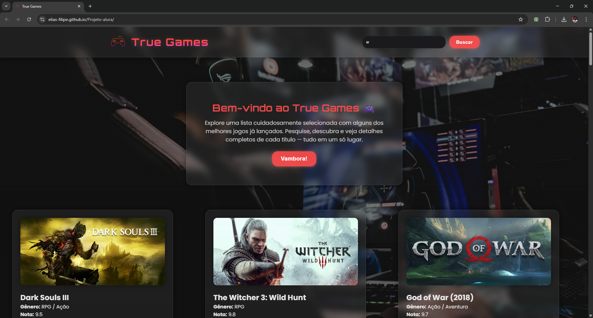
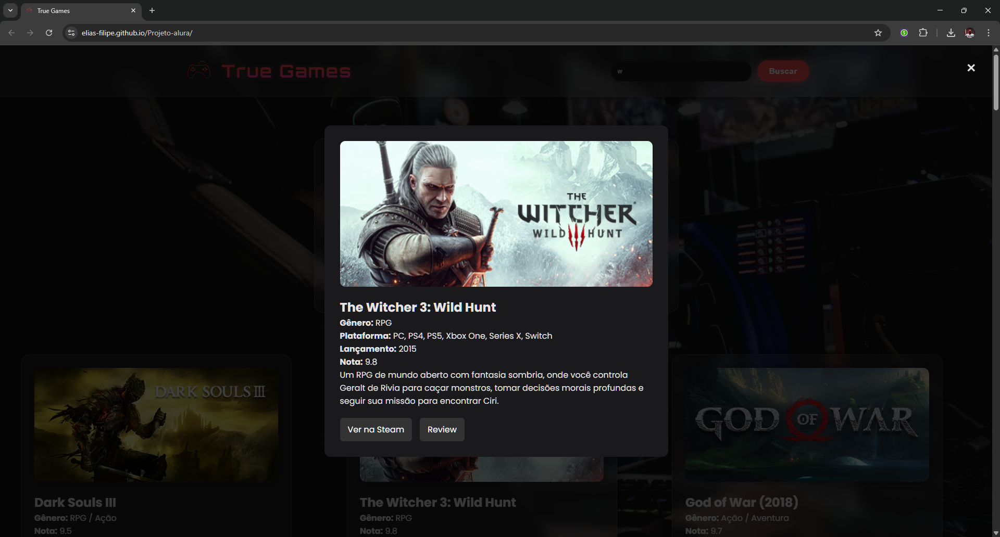

# 🎮 Projeto True Games / True Games Project

Aplicação desenvolvida durante a Imersão Dev com Google Gemini – 10ª Edição, criada para listar jogos e apresentar informações sobre cada um de forma organizada e intuitiva.
Application developed during Dev Immersion with Google Gemini – 10th Edition, created to list games and display their information clearly and intuitively.

---

## 📌 Sobre o projeto / About the project

**PT-BR**
O True Games é uma aplicação web simples e funcional que exibe uma lista de jogos carregados a partir de um arquivo local. Cada jogo é apresentado em formato de card com imagem, descrição, link externo e outras informações úteis. O projeto foi criado para praticar HTML, CSS e JavaScript, especialmente manipulação do DOM e renderização dinâmica baseada em dados.

**EN**
True Games is a simple and functional web application that displays a list of games loaded from a local data file. Each game is shown in a card format with image, description, external link, and other useful information. The project was created to practice HTML, CSS, and JavaScript, especially DOM manipulation and dynamic data rendering.

---

## ✨ Funcionalidades / Features

**PT-BR**
– Lista dinâmica de jogos
– Cards com imagem, descrição e link externo
– Layout responsivo
– Interface simples e intuitiva
– Dados carregados via JSON local
– Código organizado e fácil de manter

**EN**
– Dynamic list of games
– Cards with image, description and external link
– Responsive layout
– Simple and intuitive interface
– Data loaded from a local JSON
– Clean and maintainable code

---

## 🛠️ Tecnologias utilizadas / Technologies used

– HTML5
– CSS3
– JavaScript (ES6+)
– JSON local

---

## 🚀 Como executar / How to run

**PT-BR**

Clone o repositório:
git clone https://github.com/Elias-Filipe/Projeto-alura

Abra o arquivo index.html diretamente no navegador.
Não é necessário servidor local.

**EN**

Clone the repository:
git clone https://github.com/Elias-Filipe/Projeto-alura

Open the index.html file directly in your browser.
No local server required.

---

## 🖼️ Capturas de tela / Screenshots

Página inicial / Home page:

Card de jogo / Game card:

---

## 🗺️ Roadmap

**PT-BR**
– Implementar barra de busca
– Adicionar filtros por gênero
– Integrar API pública de jogos (RAWG)
– Criar página individual por jogo
– Adicionar modo escuro
– Melhorar animações e UI

**EN**
– Implement search bar
– Add genre filters
– Integrate public game API (RAWG)
– Create individual game pages
– Add dark mode
– Improve animations and UI

---

## 📄 Licença / License

**PT-BR**
Este projeto está sob a licença MIT.

**EN**
This project is under the MIT License.

---

## 👤 Autor / Author

Elias Filipe Semeão
GitHub: https://github.com/Elias-Filipe

LinkedIn: https://www.linkedin.com/in/elias-semeao/

Deploy: https://elias-filipe.github.io/Projeto-alura/
